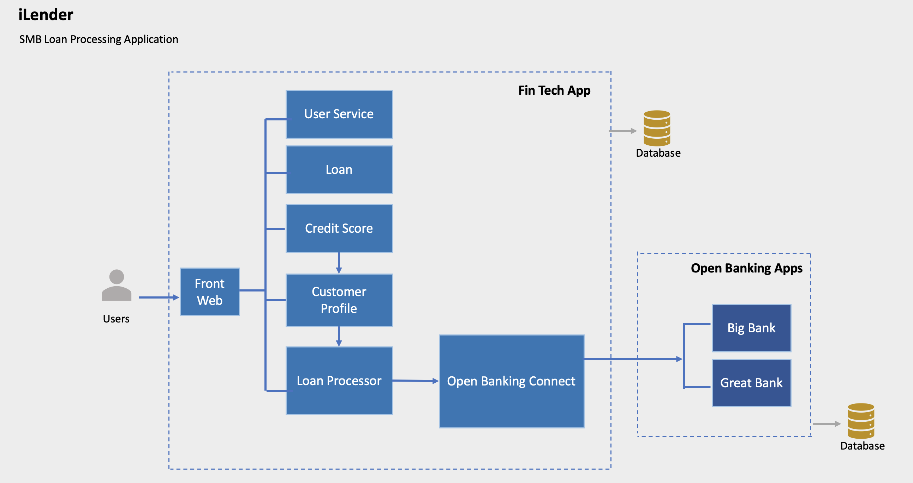
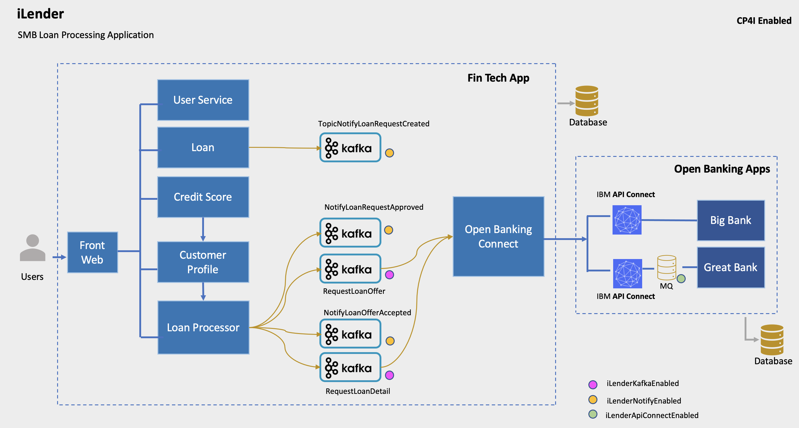
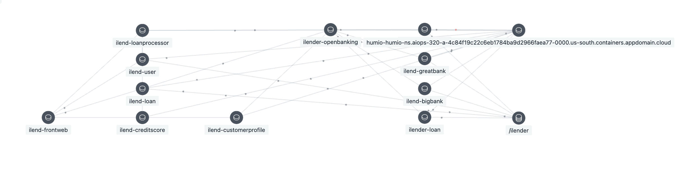
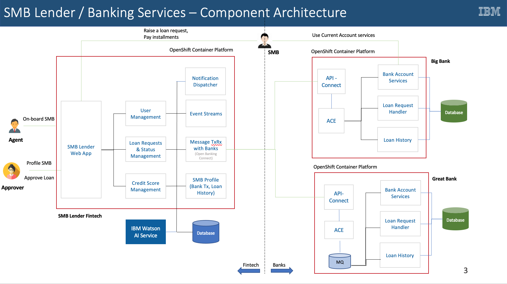
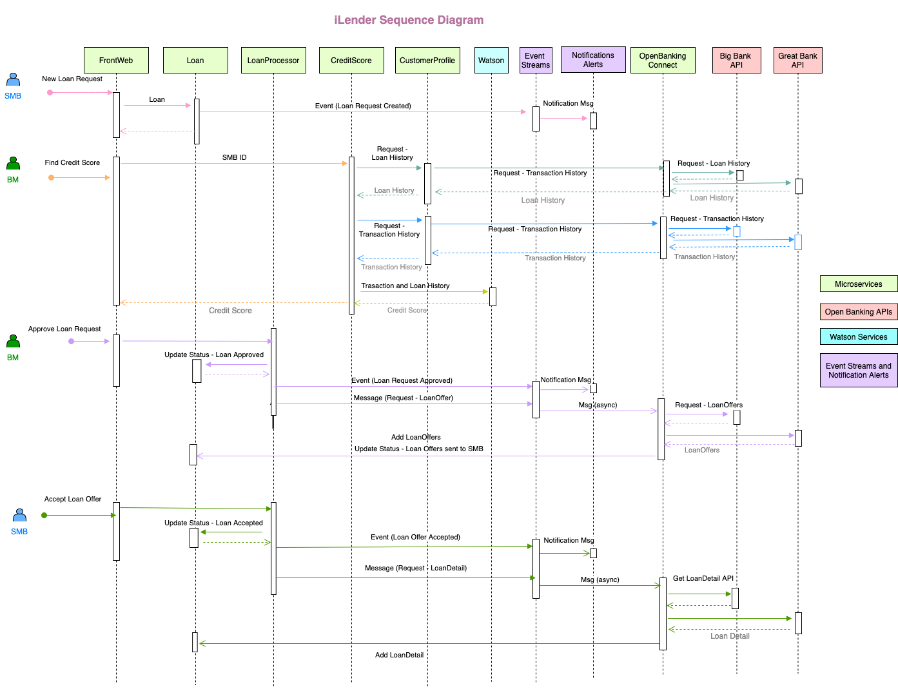
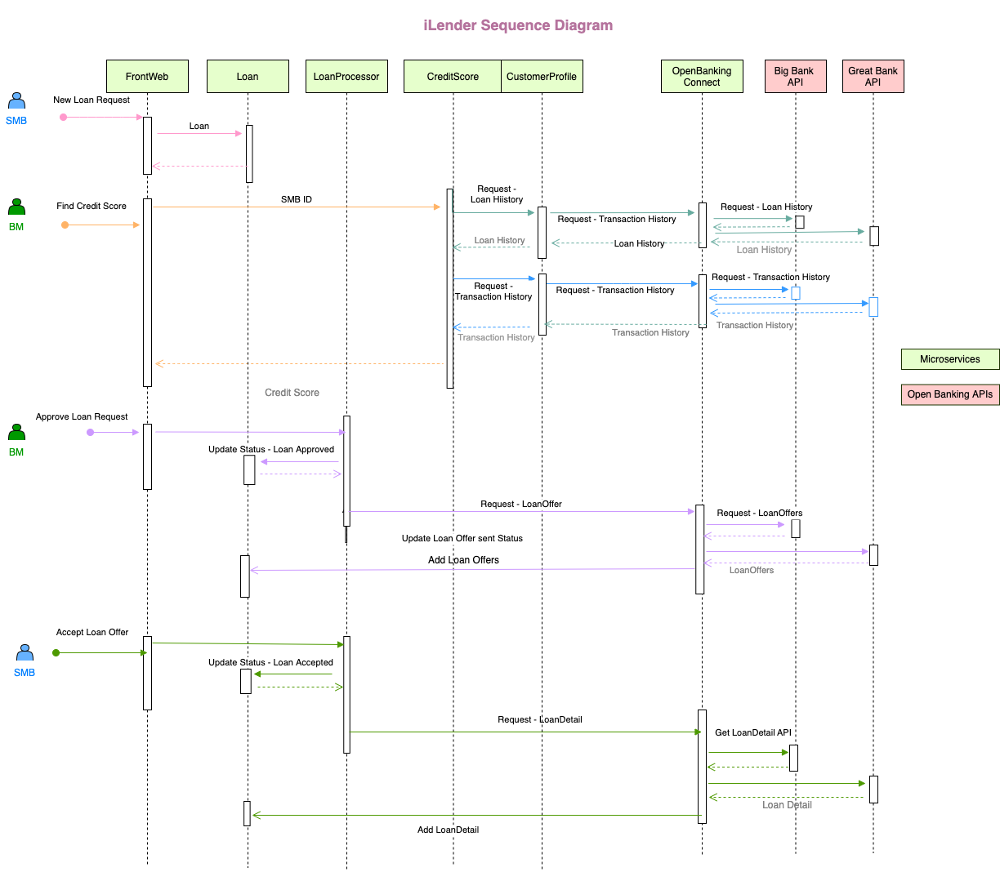

# iLender

iLender is a FinTech company who specializes in providing loans to Small and Medium Businesses (SMB) by leveraging the OpenBanking API provided by banks. iLender has the reach to SMB customer segment and has the know-how to analyze the banking transaction & loan history of SMBs retrieved through OpenBanking.

iLender adopts cloud-native strategy and develops micro-services based on Cloud Pak for Applications. With the expansion of business and inclusion of multiple Kubernetes clusters and public clouds in the IT landscape, they leverage IBM’s Cloud Pak for Multi Cloud Management to increase operational efficiency.

Banks are adopting OpenBanking to expose the banking services through an API, which can be leveraged by modern-age FinTech companies to reach out to new market segments. In the demo scenario the OpenBanking APIs are exposed by the API-Connect of Cloud Pak for Integration.

#### SMB
1.   View or Edit his profile
2.   Check details of loan history from different banks
3.   Apply for a short-term loan
4.   Check the status of the loan (submitted, awaiting response from banks, 2 bids from the bank)
5.   Choose a loan offer from among the choices presented by different banks

#### Field Agent
1.   On-board an SMB customer
2.   View or Edit SMB customer profile assigned to him/her
3.   Check the status of loan requests from SMBs

#### Business Manager
1.   Assign SMBs to Field Agents
2.   View, edit or delete SMB customer profiles
3.   View, edit or delete Field Agents
4.   View SMB bank transactions and loan history
5.   Analyze SMB profile including bank transaction and loan history with the help of AI and approve or reject the request accordingly

## Documentation

[Goto to Documentation ](docs) 

## Microservices

## Microservices with CP4I enabled

## Microservices from Instana Service Dependency

## Components Archiecture

## Sequence Diagram

## Sequence Diagram without EventStream

## License

The iLender Application is licensed under Apache-2.0 License.

This application uses Angular. The licenses related to the components used by the angular is available in `frontwebservice/angularUI/ilender-ui2/dist/wealthcare/3rdpartylicenses.txt`

